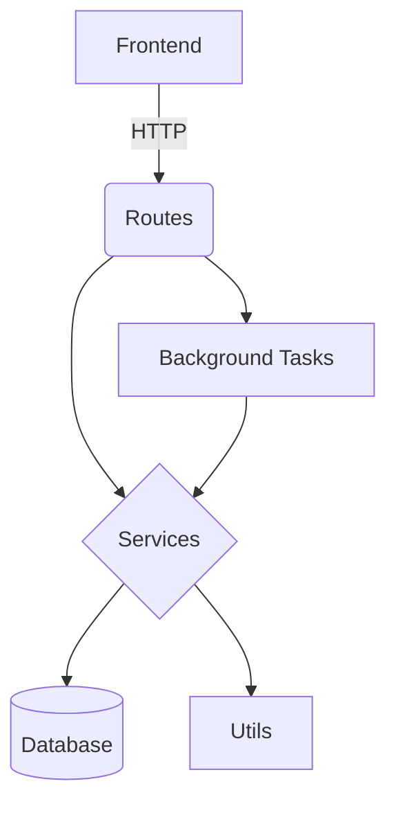

# Study Review Management System

A Flask-based web application for managing studies and reviews with admin dashboard capabilities.

## Features

- **User Authentication**: Secure login system with role-based access
- **Study Management**: Create, view, and manage studies
- **Review System**: Submit and manage reviews of studies
- **Admin Dashboard**: Administrative controls and reporting
- **Async Processing**: Celery integration for background tasks
- **Docker Support**: Containerized deployment

## Tech Stack

- **Backend**: Python, Flask
- **Database**: SQLAlchemy (SQLite)
- **Frontend**: Jinja2 templates
- **Authentication**: Flask-Login
- **Background Tasks**: Celery
- **Containerization**: Docker

## Project Structure

```
screen_extract/
├── app.py                # Main application entry point
├── config.py             # Configuration settings
├── docker-compose.yml    # Docker compose configuration
├── Dockerfile            # Docker configuration
├── requirements.txt      # Python dependencies
├── static/               # Static assets (CSS, JS, images)
├── templates/            # Frontend templates
├── models/               # Database models
│   ├── user.py           # User model
│   └── study.py          # Study model
├── routes/               # Application routes
│   ├── auth.py           # Authentication routes
│   ├── admin.py          # Admin routes
│   ├── study.py          # Study routes
│   └── review.py         # Review routes
├── services/             # Business logic
├── tests/                # Test cases
└── utils/                # Utility functions
```

## System Architecture

The application follows a modular MVC (Model-View-Controller) architecture with clear separation of concerns:

### Core Modules

1. **Authentication Module** (`routes/auth.py`, `models/user.py`)
   - Handles user registration, login, and session management
   - Implements role-based access control (RBAC)
   - Uses Flask-Login for session management

2. **Study Management Module** (`routes/study.py`, `models/study.py`)
   - CRUD operations for studies
   - Study metadata management
   - Search and filtering capabilities

3. **Review Module** (`routes/review.py`)
   - Review submission and editing
   - Review scoring and analysis
   - Approval workflows

4. **Admin Module** (`routes/admin.py`)
   - User management
   - System configuration
   - Reporting and analytics

### Supporting Components

1. **Services Layer** (`services/`)
   - Business logic encapsulation
   - Data processing and transformation
   - Integration with external systems

2. **Utilities** (`utils/`)
   - Helper functions
   - Data validation
   - Common operations

3. **Background Processing** (`celery_worker.py`)
   - Async task queue (Celery)
   - Long-running operations
   - Scheduled jobs

### Data Flow

1. **Frontend Requests** → Flask Routes → Services → Models → Database
2. **Admin Commands** → CLI Interface → Services → Models → Database
3. **Async Tasks** → Celery Workers → Services → Models → Database

### Key Design Patterns

- **Blueprint Pattern**: Route organization
- **Dependency Injection**: For service components
- **Repository Pattern**: Database access abstraction
- **Factory Pattern**: For object creation

### Technical Deep Dive

#### Database Schema
- **User Model**: Stores credentials, roles, and preferences
- **Study Model**: Tracks study metadata, status, and relationships
- **Review Model**: Manages review content, ratings, and approvals

#### Security Architecture
- CSRF protection via Flask-WTF
- Password hashing with Werkzeug
- Session management with Flask-Login
- Role-based endpoint authorization

#### Performance Considerations
- Database query optimization
- Celery task queue for heavy operations
- Frontend asset minification
- Caching strategies

#### Error Handling
- Centralized error handlers
- Logging integration
- User-friendly error pages
- API error responses

#### Module Interactions


## Setup Instructions

1. **Prerequisites**:
   - Python 3.8+
   - Docker (optional)

2. **Install dependencies**:
   ```bash
   pip install -r requirements.txt
   ```

3. **Database setup**:
   ```bash
   flask db upgrade
   ```

4. **Create admin user**:
   ```bash
   flask create-admin <username>
   ```

5. **Run development server**:
   ```bash
   flask run
   ```

6. **Run with Docker Compose**:
   Follow these detailed steps to build and run the application using Docker Compose, which will handle both the application and its dependencies (like Redis for Celery) in a containerized environment:

   - **Ensure Docker and Docker Compose are installed**: Verify that you have Docker and Docker Compose installed on your system. You can download them from the official Docker website if needed.
   - **Navigate to the project directory**: Open a terminal and change to the directory containing the `docker-compose.yml` file.
     ```bash
     cd /path/to/screen_extract
     ```
   - **Build the Docker images**: This step builds the custom Docker image for the application as defined in the Dockerfile.
     ```bash
     docker-compose build
     ```
   - **Start the containers**: This command starts all services defined in `docker-compose.yml`, including the Flask app, Redis for Celery, and any other configured services. The `--build` flag ensures the image is rebuilt if there are changes.
     ```bash
     docker-compose up --build
     ```
   - **Access the application**: Once the containers are running, the application will be accessible at `http://localhost:5000` (or the port specified in your `docker-compose.yml` file).
   - **View container logs**: To see the logs for debugging or monitoring, you can run:
     ```bash
     docker-compose logs
     ```
   - **Stop the containers**: When you're done, stop the running containers with:
     ```bash
     docker-compose down
     ```
   - **Database initialization**: On the first run, the entrypoint script will handle database migrations and initial data loading automatically. If you need to create an admin user, you can access the container shell:
     ```bash
     docker-compose exec app bash
     flask create-admin <username>
     exit
     ```

   These steps ensure a consistent and isolated environment for running the Study Review Management System.

## API Documentation

The application provides RESTful endpoints for:
- User authentication
- Study management
- Review submission
- Admin operations

## License

[MIT License](LICENSE)
