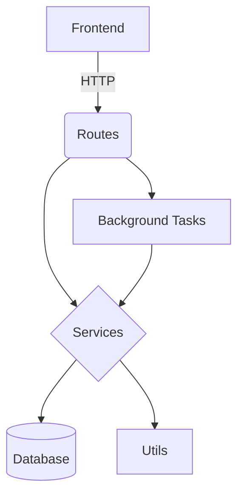

# Study Review Management System

A Flask-based web application for managing studies and reviews with admin dashboard capabilities.

## Features

- **User Authentication**: Secure login system with role-based access
- **Study Management**: Create, view, and manage studies
- **Review System**: Submit and manage reviews of studies
- **Admin Dashboard**: Administrative controls and reporting
- **Async Processing**: Celery integration for background tasks
- **Docker Support**: Containerized deployment

## Tech Stack

- **Backend**: Python, Flask
- **Database**: SQLAlchemy (SQLite)
- **Frontend**: Jinja2 templates
- **Authentication**: Flask-Login
- **Background Tasks**: Celery
- **Containerization**: Docker

## Project Structure

```
screen_extract/
├── app.py                # Main application entry point
├── config.py             # Configuration settings
├── docker-compose.yml    # Docker compose configuration
├── Dockerfile            # Docker configuration
├── requirements.txt      # Python dependencies
├── static/               # Static assets (CSS, JS, images)
├── templates/            # Frontend templates
├── models/               # Database models
│   ├── user.py           # User model
│   └── study.py          # Study model
├── routes/               # Application routes
│   ├── auth.py           # Authentication routes
│   ├── admin.py          # Admin routes
│   ├── study.py          # Study routes
│   └── review.py         # Review routes
├── services/             # Business logic
├── tests/                # Test cases
└── utils/                # Utility functions
```

## System Architecture

The application follows a modular MVC (Model-View-Controller) architecture with clear separation of concerns:

### Core Modules

1. **Authentication Module** (`routes/auth.py`, `models/user.py`)
   - Handles user registration, login, and session management
   - Implements role-based access control (RBAC)
   - Uses Flask-Login for session management

2. **Study Management Module** (`routes/study.py`, `models/study.py`)
   - CRUD operations for studies
   - Study metadata management
   - Search and filtering capabilities

3. **Review Module** (`routes/review.py`)
   - Review submission and editing
   - Review scoring and analysis
   - Approval workflows

4. **Admin Module** (`routes/admin.py`)
   - User management
   - System configuration
   - Reporting and analytics

### Supporting Components

1. **Services Layer** (`services/`)
   - Business logic encapsulation
   - Data processing and transformation
   - Integration with external systems

2. **Utilities** (`utils/`)
   - Helper functions
   - Data validation
   - Common operations

3. **Background Processing** (`celery_worker.py`)
   - Async task queue (Celery)
   - Long-running operations
   - Scheduled jobs

### Data Flow

1. **Frontend Requests** → Flask Routes → Services → Models → Database
2. **Admin Commands** → CLI Interface → Services → Models → Database
3. **Async Tasks** → Celery Workers → Services → Models → Database

### Key Design Patterns

- **Blueprint Pattern**: Route organization
- **Dependency Injection**: For service components
- **Repository Pattern**: Database access abstraction
- **Factory Pattern**: For object creation

### Technical Deep Dive

#### Database Schema
- **User Model**: Stores credentials, roles, and preferences
- **Study Model**: Tracks study metadata, status, and relationships
- **Review Model**: Manages review content, ratings, and approvals

#### Security Architecture
- CSRF protection via Flask-WTF
- Password hashing with Werkzeug
- Session management with Flask-Login
- Role-based endpoint authorization

#### Performance Considerations
- Database query optimization
- Celery task queue for heavy operations
- Frontend asset minification
- Caching strategies

#### Error Handling
- Centralized error handlers
- Logging integration
- User-friendly error pages
- API error responses

#### Module Interactions


## Setup Instructions

### Development Environment Setup

1. **Prerequisites**:
   - Python 3.10+
   - Docker (optional for production)

2. **Create and Activate Virtual Environment**:
   ```bash
   python3 -m venv venv
   source venv/bin/activate  # On Windows, use `venv\Scripts\activate`
   ```

3. **Install Dependencies**:
   ```bash
   pip install -r requirements.txt
   ```

4. **Database Setup**:
   Ensure the database directory exists and initialize the database with migrations:
   ```bash
   mkdir -p db
   flask db init  # Initialize migration repository
   flask db migrate -m "Initial migration"  # Generate migration script
   flask db upgrade  # Apply migrations to create database schema
   ```

5. **Create Admin User**:
   ```bash
   flask create-admin <username> <password>
   ```

6. **Run Development Server**:
   ```bash
   flask run
   ```
   Access the application at `http://localhost:5000`.

### Production Environment Setup (Using Docker)

1. **Prerequisites**:
   - Docker and Docker Compose installed on your system.

2. **Navigate to the Project Directory**:
   Open a terminal and change to the directory containing the `docker-compose.yml` file.
   ```bash
   cd /path/to/AnnotOCR
   ```

3. **Set Environment Variables for UID and GID**:
   Before building and starting the Docker containers, set the `HOST_UID` and `HOST_GID` environment variables to match your user and group IDs. This helps avoid permission issues with mounted volumes.
   ```bash
   export HOST_UID=$(id -u)
   export HOST_GID=$(id -g)
   ```

4. **Build the Docker Images**:
   This step builds the custom Docker image for the application as defined in the Dockerfile.
   ```bash
   docker-compose build
   ```

4. **Start the Containers**:
   This command starts all services defined in `docker-compose.yml`, including the Flask app, Redis for Celery, and any other configured services.
   ```bash
   docker-compose up -d --build
   ```
   The `-d` flag runs the containers in detached mode.

5. **Access the Application**:
   Once the containers are running, the application will be accessible at `http://localhost:5000` (or the port specified in your `docker-compose.yml` file).

6. **View Container Logs**:
   To see the logs for debugging or monitoring, you can run:
   ```bash
   docker-compose logs
   ```

7. **Stop the Containers**:
   When you're done, stop the running containers with:
   ```bash
   docker-compose down
   ```

8. **Database Initialization and Admin User**:
   On the first run, the entrypoint script handles database migrations and initial data loading automatically. If you need to create an admin user manually:
   ```bash
   docker-compose exec web bash
   flask create-admin <username> <password>
   exit
   ```

These steps ensure a consistent and isolated environment for running the Study Review Management System in both development and production setups.

## API Documentation

The application provides RESTful endpoints for:
- User authentication
- Study management
- Review submission
- Admin operations

## License

[MIT License](LICENSE)
