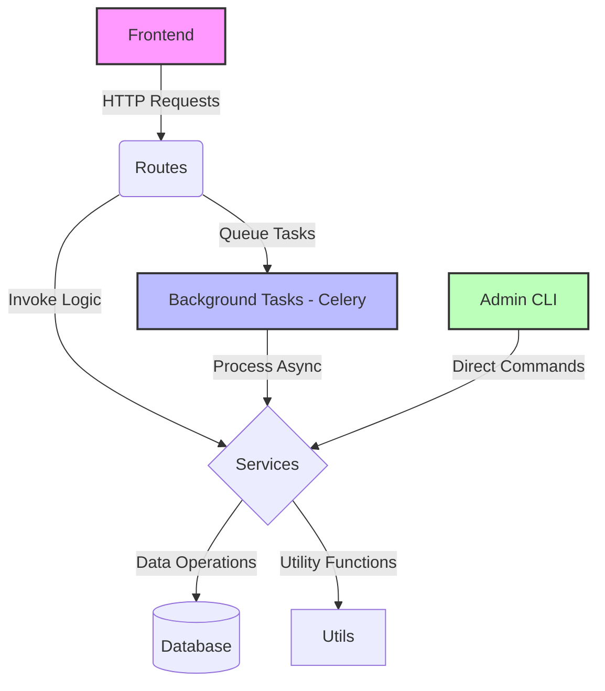

# Project Manifest - AnnotOCR

## Overview
AnnotOCR is a sophisticated Flask-based web application designed for managing, processing, and reviewing screen-captured data, with a focus on images and OCR (Optical Character Recognition) outputs. The platform supports comprehensive user authentication, study and participant management, image review workflows, and robust administrative functionalities. It is engineered to handle large datasets of images, process them through OCR services to extract textual data, and provide an intuitive interface for users to review, correct, and annotate the extracted information. The application is built with scalability and modularity in mind, leveraging modern web development practices and containerization for deployment.

## Project Purpose
The primary purpose of AnnotOCR is to streamline the extraction, review, and annotation of data from images, particularly for research, data collection, or analytical purposes. It serves as a critical tool for projects involving large volumes of visual data, such as the PROSITAIA and PROSITAIY datasets, by providing a structured environment to upload images, process them via OCR, review and correct the extracted text, and manage the overall progress of studies or data batches. AnnotOCR aims to enhance data accuracy through user-driven corrections and facilitate collaborative workflows for research teams or data analysts.

## Directory Structure and Key Components

### Root Directory
- **app.py**: The central entry point for the Flask application. This file initializes the Flask app, configures settings, sets up extensions like SQLAlchemy and Flask-Migrate for database management, and registers blueprints for routing. It also includes logic for initial database creation and admin user setup.
- **config.py**: The configuration file for the Flask app, defining critical settings such as database URIs, secret keys, Celery broker URLs, and result backends. It supports environment-specific configurations (development vs. production) through environment variables.
- **wsgi.py**: A WSGI entry point for deploying the application with production servers like Gunicorn, ensuring compatibility with web server gateways.
- **requirements.txt**: A comprehensive list of Python dependencies required for the project, including Flask, SQLAlchemy, Celery, Flask-Migrate, and other libraries essential for functionality.
- **docker-compose.yml** and **Dockerfile**: Configuration files for containerizing the application using Docker. `docker-compose.yml` defines services like the Flask web app, Celery worker, and Redis for background tasks, while `Dockerfile` specifies the build instructions for the application image.
- **entrypoint.sh**: A shell script executed when Docker containers start. It handles initialization tasks such as setting permissions for the database directory, running initial OCR processing, and starting the Gunicorn server.
- **README.md**: Project documentation providing an overview, setup instructions for development and production environments, and other relevant information for users and developers.
- **.env**: A file for environment-specific variables, including Flask environment settings, database URLs, admin credentials, and Celery configurations, ensuring sensitive data is not hardcoded into the codebase.
- **celery_worker.py**: Configures and initializes the Celery worker for background task processing, such as OCR extraction. It integrates with the Flask app context to ensure database access during task execution.
- **extensions.py**: Defines shared Flask extensions like the SQLAlchemy database instance, making them accessible across the application.

### models/
This directory contains database models that define the structure and relationships of the application's data using SQLAlchemy.
- **users.py**: Defines the `Users` model for user accounts, storing credentials, roles (e.g., admin, reviewer), and metadata like creation date and last login.
- **studies.py**: Defines the `Studies` model for organizing data into studies or projects, including metadata like study name, description, and status.
- **participants.py**: Defines the `Participants` model, representing subjects or entities within studies whose data (e.g., images) is being processed and reviewed.
- **images.py**: Defines the `Images` model for storing image metadata, file paths, or references, and linking images to studies or participants.
- **ocr_results.py**: Defines the `OCRResults` model for storing OCR-extracted text from images, along with confidence scores, language, and version information.
- **corrections.py**: Defines the `Corrections` model for recording user corrections to OCR data during the review process, tracking changes and reviewer information.

### routes/
This directory defines URL routes and view functions for the Flask application, organizing the application's endpoints into modular blueprints.
- **auth.py**: Manages authentication routes for user login, logout, and registration, implementing secure session management with Flask-Login.
- **dashboard.py**: Provides routes for the main dashboard, offering an overview of studies, review progress, and quick access to key functionalities.
- **study.py**: Handles routes for creating, viewing, editing, and managing studies, including associating participants and images with studies.
- **review.py**: Implements routes for the review workflow, enabling users to inspect OCR results, make corrections, and manage batches of data for review.
- **admin.py**: Contains administrative routes for user management, system configuration, and generating reports or analytics on application usage and data.

### services/
This directory encapsulates business logic and service layers, separating core functionality from routing and presentation layers.
- **ocr_image_extractor.py**: A critical service for processing images through OCR, extracting text data using libraries like `pytesseract`. It supports batch processing and integrates with Celery for asynchronous operation.
- **review_service.py**: Manages the review workflow, including assigning review tasks, tracking progress, saving corrections, and ensuring data integrity during the review process.
- **data_loader.py**: A utility service for importing or loading data into the system, such as bulk image uploads or initial dataset seeding.
- **ocr_cleaner.py**: Provides functionality to clean or preprocess OCR output, improving readability or accuracy before review.
- **text_validator.py**: Validates text data, potentially checking for formatting, completeness, or specific criteria during OCR processing or review.

### templates/
This directory contains HTML templates for rendering the user interface using Jinja2, structured to support various application modules.
- **base.html**: The base template extended by other templates, providing a common layout with headers, footers, navigation, and CSS/JS includes.
- **auth/login.html**: Template for the user login page, including form fields for credentials and error messaging.
- **dashboard/index.html**: Template for the main dashboard, displaying an overview of studies, statistics, and navigation options.
- **dashboard/study.html**: Template for individual study pages, showing detailed information, associated data, and actions like adding images or participants.
- **review/batch.html**: Template for batch review interfaces, allowing users to process multiple items efficiently.
- **admin/users.html**: Administrative template for managing user accounts, roles, and permissions.
- **admin/create_user.html** and **admin/edit_user.html**: Templates for creating and editing user accounts within the admin interface.
- **components/**: Contains reusable UI components like navigation bars, sidebars, or progress indicators to maintain consistency across the application.

### static/
This directory holds static assets essential for the web application's frontend.
- **css/**: Stylesheets for styling the user interface, including layout, typography, and theme customization (e.g., `styles.css`).
- **js/**: JavaScript files for client-side functionality, such as form validation, AJAX requests, or interactive UI elements (e.g., `app.js`, `autocomplete_suggestions.js`).
- **images/**: Stores image datasets for OCR processing, organized into subdirectories like `PROSITAIA` and `PROSITAIY`, containing numerous image files.
- **data/**: Contains static data files, such as JSON files for application suggestions or configurations (e.g., `app_suggestions.json`).

### tests/
This directory includes unit and integration tests to ensure the reliability and correctness of the application's components.
- **unit/test_models.py**: Unit tests for database models, verifying schema definitions and relationships.
- **unit/test_services.py**: Unit tests for service layer functions, ensuring business logic operates as expected.
- **integration/test_routes.py**: Integration tests for application routes, checking endpoint responses and user flows.
- **integration/test_review_flow.py**: Tests for the review workflow, simulating user interactions and data corrections.
- **integration/test_ui.py**: Tests for UI rendering and functionality, potentially using tools like Selenium for browser automation.

### utils/
This directory provides utility functions and helpers to support various application functionalities.
- (Note: Specific utility files are not detailed in the current file structure but are expected to include helpers for file handling, image processing, and data validation based on project needs.)

### migrations/
This directory contains database migration scripts managed by Alembic, used for schema evolution and version control.
- **alembic.ini**: Configuration file for Alembic, specifying database connection details and migration settings.
- **env.py**: Environment setup for Alembic migrations, integrating with the Flask application's database configuration.
- **versions/**: Directory for migration scripts, each representing a schema change or update.
- **script.py.mako**: Template for generating migration scripts.
- **README**: Documentation or notes on migration processes.

### db/
This directory stores the SQLite database files used by the application.
- **local_database.db**: The SQLite database file for development environments, storing all application data like users, studies, and OCR results.

## Key Features

### 1. User Authentication and Authorization
- **Secure Login System**: Implements user authentication with Flask-Login, supporting session management and secure password hashing with Werkzeug.
- **Role-Based Access Control (RBAC)**: Differentiates between user roles (e.g., admin, reviewer), restricting access to sensitive functionalities or data based on permissions.
- **User Management**: Administrative tools for creating, editing, and deleting user accounts, ensuring proper access control.

### 2. Study and Participant Management
- **Study Organization**: Allows creation and management of studies or projects, each serving as a container for related data, images, and participants.
- **Participant Tracking**: Manages participant information within studies, linking individuals or entities to specific datasets for contextual data processing.
- **Metadata and Status Tracking**: Stores detailed metadata for studies and participants, including progress status, creation dates, and descriptive information.

### 3. Image Upload and Management
- **Bulk Image Upload**: Supports uploading large numbers of images for processing, associating them with specific studies or participants.
- **Image Metadata**: Records metadata for each image, such as file paths, upload dates, and links to related entities, ensuring traceability and organization.
- **Dataset Handling**: Manages extensive image datasets (e.g., PROSITAIA, PROSITAIY), providing a structured approach to storing and accessing visual data.

### 4. OCR Processing
- **Automated Text Extraction**: Utilizes OCR libraries like `pytesseract` to extract text from images, supporting multiple languages and confidence scoring.
- **Asynchronous Processing with Celery**: Leverages Celery workers to process OCR tasks in the background, preventing UI blocking during intensive operations and improving user experience.
- **Batch Processing**: Handles multiple images simultaneously, optimizing throughput for large datasets.
- **Version Control**: Tracks OCR version and extraction timestamps, ensuring data provenance and reproducibility.

### 5. Review and Correction Workflow
- **Interactive Review Interface**: Provides a user-friendly interface for reviewing OCR results, with options to view original images alongside extracted text.
- **Correction Mechanism**: Enables users to edit and correct OCR output, saving changes as separate records to maintain an audit trail.
- **Batch and Queue Management**: Supports reviewing data in batches or through prioritized queues, streamlining the workflow for large volumes of data.
- **Progress Tracking**: Monitors review progress at individual, batch, and study levels, offering visual indicators and statistics to users.

### 6. Administrative Tools
- **User Administration**: Allows admins to manage user accounts, assign roles, and monitor user activity within the system.
- **System Configuration**: Provides interfaces for configuring application settings, such as database parameters or OCR processing options.
- **Reporting and Analytics**: Generates reports on study progress, review completion rates, and data quality metrics, aiding in decision-making and oversight.

### 7. Data Export and Integration
- **Export Capabilities**: Facilitates exporting reviewed and corrected data in various formats for further analysis or integration with external systems.
- **API Endpoints**: Offers RESTful API endpoints for programmatic access to application functionalities, supporting integration with other tools or workflows.

### 8. Containerization and Deployment
- **Docker Support**: Fully containerized setup with Docker and Docker Compose, ensuring consistent environments across development, testing, and production.
- **Scalability**: Configurable Docker services for web application and Celery workers, allowing horizontal scaling for high-demand scenarios.
- **Environment Isolation**: Uses environment variables and `.env` files to manage configuration, ensuring portability and security.

## System Architecture

AnnotOCR follows a modular Model-View-Controller (MVC) architecture with a clear separation of concerns, ensuring maintainability and extensibility.

### Core Modules
1. **Authentication Module** (`routes/auth.py`, `models/users.py`)
   - Manages user authentication, session handling, and role-based access control.
   - Integrates Flask-Login for secure user sessions and Werkzeug for password security.
2. **Study Management Module** (`routes/study.py`, `models/studies.py`, `models/participants.py`, `models/images.py`)
   - Handles CRUD operations for studies, participants, and images.
   - Organizes data hierarchically, linking images to participants and studies for contextual processing.
3. **OCR Processing Module** (`services/ocr_image_extractor.py`, `celery_worker.py`, `models/ocr_results.py`)
   - Processes images through OCR to extract text, leveraging Celery for asynchronous task execution.
   - Stores results with metadata like confidence scores and processing versions.
4. **Review Module** (`routes/review.py`, `services/review_service.py`, `models/corrections.py`)
   - Facilitates user review and correction of OCR data, supporting batch operations and progress tracking.
   - Maintains a history of corrections for auditability.
5. **Admin Module** (`routes/admin.py`)
   - Provides administrative functionalities for user management, system configuration, and reporting.
   - Ensures secure access restricted to admin roles.

### Supporting Components
1. **Services Layer** (`services/`)
   - Encapsulates business logic for OCR processing, review workflows, data loading, and validation.
   - Acts as an intermediary between routes and models, promoting code reuse and modularity.
2. **Utilities** (`utils/`)
   - Offers helper functions for file handling, image processing, data validation, and other common tasks.
   - Enhances code maintainability by centralizing shared logic.
3. **Background Processing** (`celery_worker.py`)
   - Utilizes Celery with Redis as a broker for handling long-running tasks like OCR processing.
   - Ensures scalability by distributing workload across multiple workers.

### Data Flow
1. **User Interaction Flow**: Frontend Requests → Flask Routes → Services → Models → Database
   - Users interact with the web interface, triggering HTTP requests to specific routes. These routes invoke service functions that process data using models, which interact with the database.
2. **Admin Operations Flow**: Admin Commands → CLI Interface → Services → Models → Database
   - Administrative tasks, such as creating users, are executed via command-line interfaces that directly interact with services and models.
3. **Background Task Flow**: Async Tasks → Celery Workers → Services → Models → Database
   - Intensive tasks like OCR processing are queued for Celery workers, which use services to process data and update the database asynchronously.

### Key Design Patterns
- **Blueprint Pattern**: Organizes routes into modular blueprints (e.g., auth, study, review), improving code organization and scalability.
- **Dependency Injection**: Used in services to decouple components, allowing for easier testing and flexibility.
- **Repository Pattern**: Abstracts database access through models, providing a clean interface for data operations.
- **Factory Pattern**: Employed in `app.py` for creating the Flask application instance with configurable settings.

### Technical Deep Dive

#### Database Schema
- **Users Table**: Stores user information, including `username`, `password_hash`, `role`, `email`, `created_at`, and `last_login`, supporting authentication and authorization.
- **Studies Table**: Manages study metadata with fields like `name`, `description`, `status`, and `created_at`, organizing data into logical units.
- **Participants Table**: Tracks participant details, such as `participant_id`, `study_id` (foreign key), and metadata, linking individuals to studies.
- **Images Table**: Records image data with `image_id`, `study_id`, `participant_id`, `file_path`, and `upload_date`, ensuring traceability.
- **OCR Results Table**: Stores OCR output with `image_id` (foreign key), `text`, `confidence`, `language`, `version`, and `created_at`, capturing extraction details.
- **Corrections Table**: Logs user corrections with `ocr_result_id` (foreign key), `corrected_text`, `user_id`, and `correction_date`, maintaining an audit trail.

#### Security Architecture
- **CSRF Protection**: Implemented via Flask-WTF to prevent cross-site request forgery attacks on form submissions.
- **Password Hashing**: Uses Werkzeug's secure password hashing to protect user credentials.
- **Session Management**: Leverages Flask-Login for secure user session handling, with configurable session timeouts.
- **Role-Based Authorization**: Restricts endpoint access based on user roles, ensuring data and functionality segregation.

#### Performance Considerations
- **Database Optimization**: Indexes on frequently queried fields (e.g., `study_id`, `image_id`) to speed up lookups and joins.
- **Asynchronous Processing**: Celery task queue offloads heavy OCR operations from the main application thread, improving responsiveness.
- **Batch Operations**: Supports processing and reviewing data in batches to minimize database transaction overhead.
- **Caching**: Potential for caching frequent queries or static assets to reduce server load (if implemented).

#### Error Handling
- **Centralized Error Handlers**: Custom error pages and API responses for common errors (e.g., 404, 403) to provide user-friendly feedback.
- **Logging**: Comprehensive logging of application events, errors, and user actions for debugging and monitoring.
- **Transaction Rollbacks**: Database operations within transactions to ensure data integrity during failures.

#### Module Interactions

## Development and Deployment Workflow

### Development Workflow
1. **Environment Setup**: Developers set up a virtual environment, install dependencies, and configure environment variables using `.env`.
2. **Database Initialization**: Initialize migrations with `flask db init`, generate migration scripts with `flask db migrate`, and apply them with `flask db upgrade`.
3. **Feature Development**: Code new features or fixes in respective modules (e.g., routes, services), following the MVC pattern.
4. **Testing**: Write and run unit and integration tests to validate functionality and prevent regressions.
5. **Local Server**: Run the development server with `flask run` to test changes in a local environment.

### Deployment Workflow
1. **Docker Build**: Build Docker images using `docker-compose build` to package the application and dependencies.
2. **Container Deployment**: Deploy containers with `docker-compose up -d --build`, running the web app, Celery workers, and Redis.
3. **Database Setup**: Ensure database migrations are applied automatically via `entrypoint.sh` or manually if needed.
4. **Monitoring**: Monitor container logs with `docker-compose logs` to troubleshoot issues or verify operation.
5. **Scaling**: Adjust the number of Celery worker containers in `docker-compose.yml` to handle increased load if necessary.

## Recommendations for Improvement
- **Enhanced Documentation**: Add detailed inline comments in critical code sections and maintain comprehensive user and developer guides in `README.md`.
- **Performance Optimization**: Implement caching for static assets and frequent database queries. Optimize image storage and OCR processing for large datasets in `static/images/`.
- **Security Enhancements**: Regularly update dependencies to patch vulnerabilities. Consider adding two-factor authentication for admin accounts.
- **Testing Coverage**: Expand test coverage for edge cases in OCR processing and review workflows. Implement automated testing in CI/CD pipelines.
- **User Experience**: Enhance the review interface with features like inline image annotations or real-time collaboration for multiple reviewers.
- **Scalability**: Explore database sharding or migration to a more scalable database (e.g., PostgreSQL) for production environments with large data volumes.

## Notes
This manifest provides an exhaustive overview of the AnnotOCR project, detailing its structure, functionalities, architecture, and operational workflows. It serves as a foundational document for developers, administrators, and stakeholders to understand the system's capabilities and design. For further granular details on specific files or functionalities, refer to inline code comments or additional documentation within the codebase. If updates or deeper analysis are required, this manifest can be expanded accordingly.
